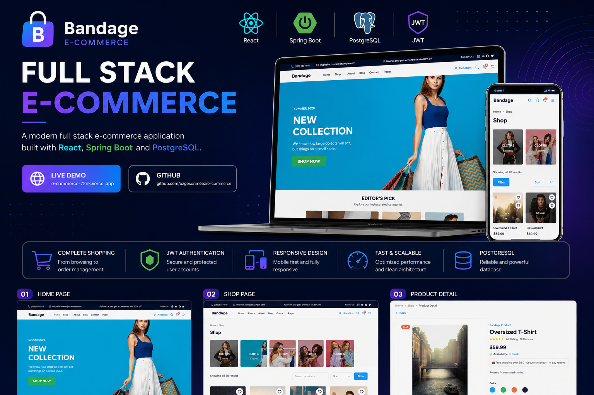

<p align="center">
  
</p>

<br>

# 🛍️ Full Stack E-Commerce Platform

A modern Full Stack E-Commerce...

[](https://e-commerce-72nk.vercel.app)

[](https://github.com/ozgesonmeez/e-commerce)

</div>
 Full Stack E-Commerce Platform
---

# 📖 Overview

This project is a **full-stack e-commerce platform** developed using modern frontend and backend technologies.

It provides a complete shopping experience including user authentication, product browsing, shopping cart, favorites, checkout, payment flow, and order management.

The project was built to gain real-world experience with scalable full-stack application development while following clean architecture principles.

---

# ✨ Features

<table>
<tr>
<td width="50%">

## 👤 Authentication

- ✅ Register
- ✅ Login
- ✅ JWT Authentication
- ✅ Protected Routes

</td>

<td width="50%">

## 🛒 Shopping

- ✅ Product Listing
- ✅ Product Details
- ✅ Categories
- ✅ Shopping Cart
- ✅ Favorites

</td>
</tr>

<tr>
<td>

## 📦 Checkout

- ✅ Address Management
- ✅ Payment Step
- ✅ Order Creation
- ✅ Previous Orders

</td>

<td>

## ⚙ Backend

- ✅ REST APIs
- ✅ Spring Boot
- ✅ PostgreSQL
- ✅ Spring Data JPA
- ✅ Layered Architecture

</td>
</tr>
</table>

---

# 🛠 Tech Stack

<div align="center">

### Frontend


### Backend


</div>


---

# 🏗 Architecture

```
Frontend (React)

↓

Axios

↓

Spring Boot REST API

↓

Spring Data JPA

↓

PostgreSQL
```

---

# 📂 Folder Structure

```
Frontend
│
├── Components
├── Pages
├── Layout
├── Redux
├── Router
├── Services
└── Assets

Backend
│
├── Config
├── Controller
├── DTO
├── Entity
├── Repository
├── Security
├── Service
└── Exception
```

---

# 🚀 Installation

## Clone

```bash
git clone https://github.com/ozgesonmeez/e-commerce.git
```

---

## Frontend

```bash
npm install

npm run dev
```

---

## Backend

```bash
./mvnw spring-boot:run
```

---

# 🌐 Live Demo

## https://e-commerce-72nk.vercel.app

---

# 🎯 What I Learned

✔ React Architecture

✔ Redux State Management

✔ REST API Development

✔ Spring Boot

✔ JWT Authentication

✔ Spring Data JPA

✔ PostgreSQL

✔ Responsive Design

✔ Clean Code

✔ Git Workflow

✔ Full Stack Development

---

# 🚀 Future Improvements

- Admin Dashboard
- Product Reviews
- Search & Filtering Improvements
- Email Verification
- Password Reset
- Docker
- Unit Tests
- CI/CD Pipeline

---

# 👩‍💻 About Me

Hi 👋

I'm **Özge Sönmez**, a **Junior Full Stack Developer** passionate about building scalable web applications.

Currently focused on

- Java
- Spring Boot
- React
- PostgreSQL

---

# 📫 Contact

**LinkedIn**

https://linkedin.com/in/ozgesonmezdev

**GitHub**

https://github.com/ozgesonmeez

**Email**

ozgesonmez1@outlook.com

---

<div align="center">

### ⭐ If you like this project, don't forget to leave a star ⭐

</div>
